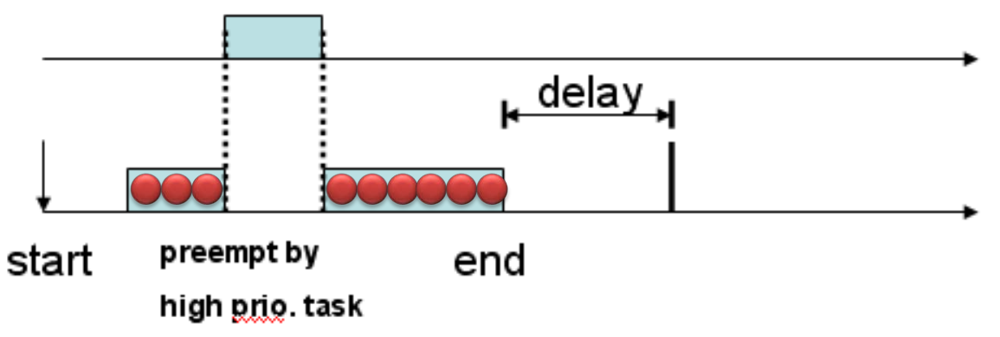

# 實驗1

## 實驗1

### 目標

1. 用RM方法製作\({1,3},{3,6}\)

| Tick | 0 | 1 | 2 | 3 | 4 | 5 | 6 | 7 | 8 | 9 | 10 | 11 | 12 | 13 |
| :---: | :---: | :---: | :---: | :---: | :---: | :---: | :---: | :---: | :---: | :---: | :---: | :---: | :---: | :---: |
| Idle | o |  |  |  |  |  | o |  |  |  |  |  | o |  |
| Task1 |  | o |  |  | o |  |  | o |  |  | o |  |  | o |
| Task2 |  |  | o | o |  | o |  |  | o | o |  | o |  |  |

2. 用RM方法製作\({1,3},{3,6},{4,9}\)，任務超過deadline時要顯示出來。



1.的使用率未達100%，可以直接排程; 2.的使用率超過100%，所以task3會超過deadline。


### 說明



為了使得兩個task能依照目標的要求完成，必須修改一些系統的內容，下面程式是根據上方的時序圖所編寫



```c
void task(void *pdata){
  start = OSTimeGet();
  OSTCBCur->period =3;
  OSTCBCur->compTime=1;
  while(1){
  
    while(OSTCBCur->compTime>0);    //wait unitl the next execute
    end = OSTimeGet();
    toDelay = (OSTCBCur->period)-(end-start);
    start +=  (OSTCBCur->period);
    OS_ENTER_CRITICAL();

    OSTCBCur->compTime = c;
    OS_EXIT_CRITICAL();
    printf("task1\n");
    OSTimeDly(toDelay);
  }
}
```




用 OS\_ENTER\_CRITICAL\(\) 以及 OS\_EXIT\_CRITICAL夾住，確保compTime再執行過程中不會被OSTimeTick打擾。


### Step1

需要修改[任務控制塊](../../task-management-1/task-control-table.md#ren-kong-zhi-task-control-block)，首先在uCOS\_II.H中找到os\_tcb並新增兩個成員 \`compTime\`和\`period\` ，型態為INT16U。compTime類似於count的功能，將會在OSTimeTick中被使用。period則是task的週期。



```c
typedef struct os_tcb {
    OS_STK        *OSTCBStkPtr;        /* Pointer to current top of stack                              */

#if OS_TASK_CREATE_EXT_EN > 0
    void          *OSTCBExtPtr;        /* Pointer to user definable data for TCB extension             */
    OS_STK        *OSTCBStkBottom;     /* Pointer to bottom of stack                                   */
    INT32U         OSTCBStkSize;       /* Size of task stack (in number of stack elements)             */
    INT16U         OSTCBOpt;           /* Task options as passed by OSTaskCreateExt()                  */
    INT16U         OSTCBId;            /* Task ID (0..65535)                                           */
#endif

    struct os_tcb *OSTCBNext;          /* Pointer to next     TCB in the TCB list                      */
    struct os_tcb *OSTCBPrev;          /* Pointer to previous TCB in the TCB list                      */

#if ((OS_Q_EN > 0) && (OS_MAX_QS > 0)) || (OS_MBOX_EN > 0) || (OS_SEM_EN > 0) || (OS_MUTEX_EN > 0)
    OS_EVENT      *OSTCBEventPtr;      /* Pointer to event control block                               */
#endif

#if ((OS_Q_EN > 0) && (OS_MAX_QS > 0)) || (OS_MBOX_EN > 0)
    void          *OSTCBMsg;           /* Message received from OSMboxPost() or OSQPost()              */
#endif

#if (OS_VERSION >= 251) && (OS_FLAG_EN > 0) && (OS_MAX_FLAGS > 0)
#if OS_TASK_DEL_EN > 0
    OS_FLAG_NODE  *OSTCBFlagNode;      /* Pointer to event flag node                                   */
#endif
    OS_FLAGS       OSTCBFlagsRdy;      /* Event flags that made task ready to run                      */
#endif

    INT16U         compTime;
    INT16U         period;
    INT16U         OSTCBDly;           /* Nbr ticks to delay task or, timeout waiting for event        */
    INT8U          OSTCBStat;          /* Task status                                                  */
    INT8U          OSTCBPrio;          /* Task priority (0 == highest, 63 == lowest)                   */

    INT8U          OSTCBX;             /* Bit position in group  corresponding to task priority (0..7) */
    INT8U          OSTCBY;             /* Index into ready table corresponding to task priority        */
    INT8U          OSTCBBitX;          /* Bit mask to access bit position in ready table               */
    INT8U          OSTCBBitY;          /* Bit mask to access bit position in ready group               */

#if OS_TASK_DEL_EN > 0
    BOOLEAN        OSTCBDelReq;        /* Indicates whether a task needs to delete itself              */
#endif
} OS_TCB;
```



### Step2

在OS\_CORE.c中找到OSTimeTick\(\)並在每次進入時讓compTime減1。\`ptcb\`為os\_tcb的指標型態，\`OSTCBList\`為指向第一個任務控制塊的指標。



```c
void  OSTimeTick (void)
{
#if OS_CRITICAL_METHOD == 3                                /* Allocate storage for CPU status register */
    OS_CPU_SR  cpu_sr;
#endif
    OS_TCB    *ptcb;


    OSTimeTickHook();                                      /* Call user definable hook                 */
#if OS_TIME_GET_SET_EN > 0
    OS_ENTER_CRITICAL();                                   /* Update the 32-bit tick counter           */
    OSTime++;
    OS_EXIT_CRITICAL();
#endif
    if (OSRunning == TRUE) {
        ptcb = OSTCBList;
        while (ptcb->OSTCBPrio != OS_IDLE_PRIO) {          /* Go through all TCBs in TCB list          */
            OS_ENTER_CRITICAL();

            if (ptcb->OSTCBDly != 0) {
              if(ptcb->compTime>0){
                ptcb->compTime --;
              }
                                        /* Delayed or waiting for event with TO     */
                if (--ptcb->OSTCBDly == 0) {               /* Decrement nbr of ticks to end of delay   */
                    if ((ptcb->OSTCBStat & OS_STAT_SUSPEND) == OS_STAT_RDY) { /* Is task suspended?    */


                        OSRdyGrp               |= ptcb->OSTCBBitY; /* No,  Make task R-to-R (timed out)*/
                        OSRdyTbl[ptcb->OSTCBY] |= ptcb->OSTCBBitX;
                    } else {                               /* Yes, Leave 1 tick to prevent ...         */
                        ptcb->OSTCBDly = 1;                /* ... loosing the task when the ...        */

                    }                                      /* ... suspension is removed.               */
                }
            }
            ptcb = ptcb->OSTCBNext;                        /* Point at next TCB in TCB list            */
            OS_EXIT_CRITICAL();
        }
    }
}
```



### Step3

在主程式中掛起兩個任務task1以及task2，並配置兩個任務的c和p。



```text
void task1(void *pdata);
void task2(void *pdata);
```



```c
void task1(void *pdata){
  //init
  INT16U start;
  INT16U end;
  INT16U toDelay;

  INT8U  c = 1;

  pdata = pdata;
  start = OSTimeGet();
  OSTCBCur->period =3;
  OSTCBCur->compTime=1;
  while(1){
    while(OSTCBCur->compTime>0);    //wait unitl the next execute


    end = OSTimeGet();
    toDelay = (OSTCBCur->period)-(end-start);

    start +=  (OSTCBCur->period);
  OS_ENTER_CRITICAL();

    OSTCBCur->compTime = c;
   OS_EXIT_CRITICAL();


    printf("task1\n");
    //OSPendSem();

    OSTimeDly(toDelay);

  }
}
```



```c
void task2(void *pdata){
  //init
  INT16U start;
  INT16U end;
  INT16U toDelay;
  INT8U  c = 3;
  pdata = pdata;

  OSTCBCur->period =6;
  OSTCBCur->compTime=3;
  start = OSTimeGet();
  while(1){
    while(OSTCBCur->compTime>0);    //wait unitl the next excute
    end = OSTimeGet();
    toDelay = (OSTCBCur->period)-(end-start);


    start +=  (OSTCBCur->period);


     OS_ENTER_CRITICAL();

    OSTCBCur->compTime = c;
    OS_EXIT_CRITICAL();
    printf("task2\n");
    //OSPendSem();
    OSTimeDly(toDelay);

  }
}

```



```c

#include "includes.h"


#define  TASK_STK_SIZE                 512       /* Size of each task's stacks (# of WORDs)            */
#define  N_TASKS                        10       /* Number of identical tasks                          */

OS_STK        TaskStk[N_TASKS][TASK_STK_SIZE];        /* Tasks stacks                                  */
OS_STK        TaskStartStk[TASK_STK_SIZE];
char          TaskData[N_TASKS];                      /* Parameters to pass to each task               */
OS_EVENT     *RandomSem;


        void  Task(void *data);                       /* Function prototypes of tasks                  */
        void  TaskStart(void *data);                  /* Function prototypes of Startup task           */
static  void  TaskStartCreateTasks(void);
static  void  TaskStartDispInit(void);
static  void  TaskStartDisp(void);
void task1(void *pdata);
void task2(void *pdata);


void  main (void)
{
    PC_DispClrScr(DISP_FGND_WHITE + DISP_BGND_BLACK);      /* Clear the screen                         */

    OSInit();                                              /* Initialize uC/OS-II                      */

    PC_DOSSaveReturn();                                    /* Save environment to return to DOS        */
    PC_VectSet(uCOS, OSCtxSw);                             /* Install uC/OS-II's context switch vector */

    RandomSem   = OSSemCreate(1);                          /* Random number semaphore                  */


  OSTaskCreate(TaskStart, (void *)0, &TaskStartStk[TASK_STK_SIZE - 1], 0);
  OSStart();                                             /* Start multitasking                       */
}

void task1(void *pdata){
  //init
  INT16U start;
  INT16U end;
  INT16U toDelay;

  INT8U  c = 1;

  pdata = pdata;
  start = OSTimeGet();
  OSTCBCur->period =3;
  OSTCBCur->compTime=1;
  while(1){
    while(OSTCBCur->compTime>0);    //wait unitl the next execute


    end = OSTimeGet();
    toDelay = (OSTCBCur->period)-(end-start);

    start +=  (OSTCBCur->period);
  OS_ENTER_CRITICAL();

    OSTCBCur->compTime = c;
   OS_EXIT_CRITICAL();


    printf("task1\n");
    //OSPendSem();

    OSTimeDly(toDelay);

  }
}
void task2(void *pdata){
  //init
  INT16U start;
  INT16U end;
  INT16U toDelay;
  INT8U  c = 3;
  pdata = pdata;

  OSTCBCur->period =6;
  OSTCBCur->compTime=3;
  start = OSTimeGet();
  while(1){
    while(OSTCBCur->compTime>0);    //wait unitl the next excute
    end = OSTimeGet();
    toDelay = (OSTCBCur->period)-(end-start);


    start +=  (OSTCBCur->period);


     OS_ENTER_CRITICAL();

    OSTCBCur->compTime = c;
    OS_EXIT_CRITICAL();
    printf("task2\n");
    //OSPendSem();
    OSTimeDly(toDelay);

  }
}

void  TaskStart (void *pdata)
{
#if OS_CRITICAL_METHOD == 3                                /* Allocate storage for CPU status register */
    OS_CPU_SR  cpu_sr;
#endif
    char       s[100];
    INT16S     key;


    pdata = pdata;                                         /* Prevent compiler warning                 */


    OS_ENTER_CRITICAL();
    PC_VectSet(0x08, OSTickISR);                           /* Install uC/OS-II's clock tick ISR        */
    PC_SetTickRate(OS_TICKS_PER_SEC);                      /* Reprogram tick rate                      */
    OS_EXIT_CRITICAL();

    OSStatInit();                                          /* Initialize uC/OS-II's statistics         */

                                 /* Create all the application tasks         */
     OSTaskCreate(task1, (void *)0, &TaskStk[0][TASK_STK_SIZE-1], 1);
     OSTaskCreate(task2, (void *)0, &TaskStk[1][TASK_STK_SIZE-1], 2);
    for (;;) {

        if (PC_GetKey(&key) == TRUE) {                     /* See if key has been pressed              */
            if (key == 0x1B) {                             /* Yes, see if it's the ESCAPE key          */
                PC_DOSReturn();                            /* Return to DOS                            */
            }
        }

        OSCtxSwCtr = 0;                                    /* Clear context switch counter             */
        OSTimeDlyHMSM(0, 0, 1, 0);                         /* Wait one second                          */
    }
}

```






